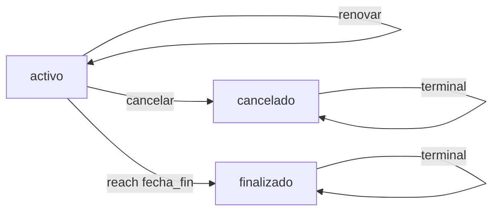

## Overview

Cancels an active rental contract and updates the property status back to available. This endpoint should validate that all financial obligations are settled before allowing cancellation.

<Warning>
  This endpoint is defined in the routes but not yet implemented in the controller. The implementation details below represent the expected behavior based on the route definition.
</Warning>

## Authentication

<ParamField header="Authorization" type="string" required>
  Bearer token for authentication
</ParamField>

## Path Parameters

<ParamField path="id" type="integer" required>
  The contract ID to cancel
</ParamField>

## Expected Request Body

<ParamField body="motivo" type="string">
  Optional cancellation reason for record-keeping
</ParamField>

## Expected Request Example

```json
{
  "motivo": "Inquilino solicitó finalizar contrato anticipadamente"
}
```

## Expected Validation Rules

### Authorization

Only the property owner (landlord) should be able to cancel contracts.

### Contract Status

Contract must be in `activo` status to be cancelled. Cannot cancel contracts that are already `cancelado` or `finalizado`.

### Outstanding Payments

<Warning>
  **Critical Validation:** The contract should NOT be cancelled if there are outstanding payments.
</Warning>

```php
$pagosPendientes = $contrato->pagos()
    ->whereIn('estatus', ['pendiente', 'vencido'])
    ->count();

if ($pagosPendientes > 0) {
    abort(422, 'No se puede cancelar el contrato con pagos pendientes');
}
```

### Deposit Handling

Implementations should consider how to handle the security deposit when cancelling:
- Mark it for return to tenant
- Require explicit deposit disposition

## Expected Database Transaction

The cancellation should atomically:

1. Update contract status to `cancelado`
2. Update property (`inmueble`) status back to `disponible`
3. Optionally log the cancellation reason

```php
DB::transaction(function () use ($contrato, $motivo) {
    $contrato->update([
        'estatus' => 'cancelado',
        'motivo_cancelacion' => $motivo,
        'fecha_cancelacion' => now(),
    ]);
    
    $contrato->inmueble->update([
        'estatus' => 'disponible'
    ]);
});
```

## Expected Response

```json
{
  "id": 15,
  "inmueble_id": 7,
  "propietario_id": 3,
  "inquilino_id": 42,
  "fecha_inicio": "2026-04-01",
  "fecha_fin": "2027-04-01",
  "renta_mensual": 18000.00,
  "deposito": 36000.00,
  "estatus": "cancelado",
  "created_at": "2026-03-04T15:30:00.000000Z",
  "updated_at": "2026-08-10T14:25:00.000000Z"
}
```

## Implementation Status

<Note>
  **Route Defined:** `routes/api.php:78`
  
  **Controller Method:** Not yet implemented
  
  To implement this endpoint, add the `cancelar` method to `ContratoController`:
  
  ```php
  public function cancelar(Request $request, Contrato $contrato)
  {
      // Validate authorization
      if ($contrato->propietario_id !== $request->user()->id) {
          abort(403, 'Solo el propietario puede cancelar este contrato');
      }
      
      // Validate contract status
      if ($contrato->estatus !== 'activo') {
          abort(422, 'Solo se pueden cancelar contratos activos');
      }
      
      // Check for outstanding payments
      $pagosPendientes = $contrato->pagos()
          ->whereIn('estatus', ['pendiente', 'vencido'])
          ->count();
          
      if ($pagosPendientes > 0) {
          abort(422, 'No se puede cancelar el contrato con pagos pendientes');
      }
      
      // Cancel contract and free property
      DB::transaction(function () use ($contrato, $request) {
          $contrato->update([
              'estatus' => 'cancelado',
              'motivo_cancelacion' => $request->input('motivo'),
          ]);
          
          $contrato->inmueble->update([
              'estatus' => 'disponible'
          ]);
      });
      
      return response()->json($contrato);
  }
  ```
</Note>

## Contract Status Workflow



### Status Definitions

- **activo**: Contract is currently active and generating payment obligations
- **cancelado**: Contract was terminated early
- **finalizado**: Contract completed normally at `fecha_fin`

## Expected Error Responses

<ResponseField name="403 Forbidden">
  User is not the property owner
  ```json
  {
    "message": "Solo el propietario puede cancelar este contrato"
  }
  ```
</ResponseField>

<ResponseField name="422 Unprocessable Entity">
  Contract cannot be cancelled (wrong status or outstanding payments)
  ```json
  {
    "message": "No se puede cancelar el contrato con pagos pendientes"
  }
  ```
  
  or
  
  ```json
  {
    "message": "Solo se pueden cancelar contratos activos"
  }
  ```
</ResponseField>

<ResponseField name="404 Not Found">
  Contract does not exist
  ```json
  {
    "message": "No query results for model [App\\Models\\Contrato]."
  }
  ```
</ResponseField>

## Best Practices

### Pre-Cancellation Checklist

1. **Verify all payments are settled**
   ```bash
   GET /api/contratos/{id}/estado-cuenta
   ```

2. **Check for outstanding balances**
   ```bash
   GET /api/pagos/pendientes
   ```

3. **Generate final statement**
   ```bash
   GET /api/contratos/{id}/estado-cuenta/excel
   ```

4. **Proceed with cancellation**
   ```bash
   POST /api/contratos/{id}/cancelar
   ```

### Notification Workflow

After cancellation:
- Notify tenant of contract cancellation
- Notify tenant of deposit return process
- Update property listing status
- Archive contract documents

## Related Endpoints

- [List Contracts](/api/contracts/list) - View all contracts
- [Get Statement](/api/contracts/statement) - Verify payment status before cancellation
- [Pending Payments](/api/payments/pending) - Check for outstanding payments

## Source Reference

- Route: `routes/api.php:78`
- Controller: `app/Http/Controllers/Api/ContratoController.php` (method not yet implemented)
- Model: `app/Models/Contrato.php`
- Migration: `database/migrations/2026_01_25_193638_create_contratos_table.php`