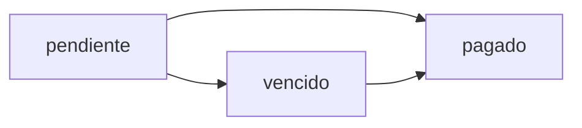

## Authentication

This endpoint requires authentication via Sanctum token.

```bash
Authorization: Bearer {token}
```

## Path Parameters

<ParamField path="id" type="integer" required>
  Payment ID to process
</ParamField>

## Authorization

**Only the tenant (inquilino) of the contract can process payments.**

- The authenticated user's ID must match the `inquilino_id` of the contract
- Returns 403 error if user is not authorized

## Business Logic

### Payment Validation

- Payment must not already be in `pagado` status
- Returns 422 error if payment is already completed

### Payment Processing

- Updates payment status to `pagado`
- Records current timestamp in `fecha_pago`
- Returns the updated payment record

## Request

No request body required.

## Response

Returns the updated payment object.

<ResponseField name="id" type="integer">
  Payment record ID
</ResponseField>

<ResponseField name="contrato_id" type="integer">
  Associated contract ID
</ResponseField>

<ResponseField name="mes" type="integer">
  Month number (1-12)
</ResponseField>

<ResponseField name="anio" type="integer">
  Year
</ResponseField>

<ResponseField name="monto" type="decimal">
  Payment amount
</ResponseField>

<ResponseField name="estatus" type="enum">
  Payment status (will be `pagado` after processing)
</ResponseField>

<ResponseField name="fecha_pago" type="timestamp">
  Timestamp when payment was processed
</ResponseField>

<ResponseField name="created_at" type="timestamp">
  Creation timestamp
</ResponseField>

<ResponseField name="updated_at" type="timestamp">
  Last update timestamp
</ResponseField>

## Example Request

```bash
curl -X POST https://api.arrendaco.com/api/pagos/15/pagar \
  -H "Authorization: Bearer {token}" \
  -H "Accept: application/json"
```

## Example Response

```json
{
  "id": 15,
  "contrato_id": 3,
  "mes": 3,
  "anio": 2026,
  "monto": "15000.00",
  "estatus": "pagado",
  "fecha_pago": "2026-03-04T14:25:30.000000Z",
  "created_at": "2026-02-01T10:00:00.000000Z",
  "updated_at": "2026-03-04T14:25:30.000000Z"
}
```

## Error Responses

### Unauthorized User

```json
{
  "message": "No autorizado para pagar este recibo"
}
```

**Status Code:** 403

### Payment Already Completed

```json
{
  "message": "Este pago ya fue liquidado"
}
```

**Status Code:** 422

## Late Fee Calculation

While the Pago model includes fields for late fee tracking (`dias_atraso`, `recargo`, `total_con_recargo`), the current controller implementation does not automatically calculate late fees.

### Available Fields (for future implementation)

- `dias_atraso`: Days overdue
- `recargo`: Late fee amount
- `total_con_recargo`: Total amount including late fees

These fields are defined in the model (`app/Models/Pago.php:19-21`) but not currently populated by the controller.

## Payment Status Flow



- **pendiente**: Payment not yet made and not overdue
- **vencido**: Payment is overdue
- **pagado**: Payment completed

## Implementation Reference

See `app/Http/Controllers/Api/PagoController.php:66`