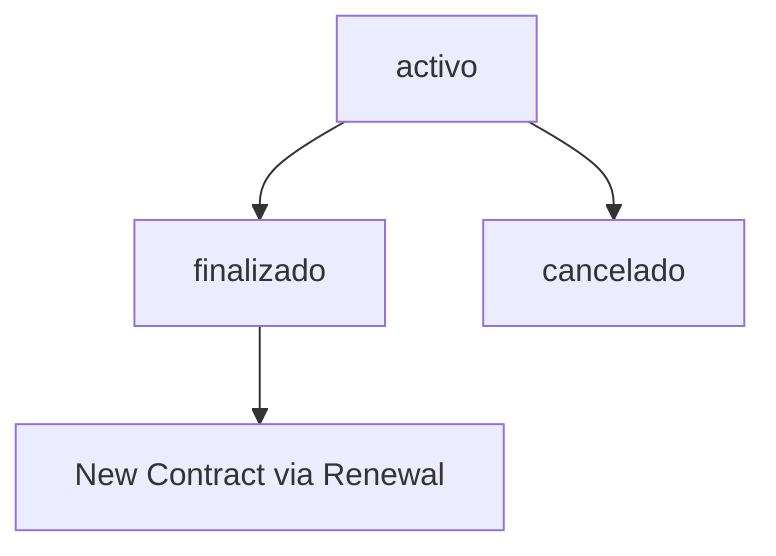

## Overview

ArrendaOco's contract system manages the entire rental lifecycle: contract creation, rent payments, renewals, cancellations, and account statements.

## Contract Model

### Database Schema

From migration `2026_01_25_193638_create_contratos_table.php`:

```php
Schema::create('contratos', function (Blueprint $table) {
    $table->id();
    
    $table->foreignId('inmueble_id')
          ->constrained('inmuebles')
          ->cascadeOnDelete();
    
    $table->foreignId('propietario_id')
          ->constrained('usuarios')
          ->cascadeOnDelete();
    
    $table->foreignId('inquilino_id')
          ->constrained('usuarios')
          ->cascadeOnDelete();
    
    $table->date('fecha_inicio');
    $table->date('fecha_fin')->nullable();
    
    $table->decimal('renta_mensual', 10, 2);
    $table->decimal('deposito', 10, 2)->nullable();
    
    $table->enum('estatus', ['activo', 'finalizado', 'cancelado'])
          ->default('activo');
    
    $table->timestamps();
});
```

### Fields

| Field | Type | Description |
|-------|------|-------------|
| `inmueble_id` | foreign key | Property being rented |
| `propietario_id` | foreign key | Landlord (owner) |
| `inquilino_id` | foreign key | Tenant |
| `fecha_inicio` | date | Contract start date |
| `fecha_fin` | date | Contract end date (nullable for open-ended) |
| `renta_mensual` | decimal | Monthly rent amount |
| `deposito` | decimal | Security deposit |
| `estatus` | enum | `activo`, `finalizado`, `cancelado` |

## Creating a Contract

### API Endpoint

**Route**: `POST /api/inmuebles/{inmueble}/rentar`

**Authorization**: Only the property owner can create a contract

**Request Example**:

```json
{
  "inquilino_id": 5,
  "fecha_inicio": "2026-03-01",
  "fecha_fin": "2027-03-01",
  "renta_mensual": 3500.00,
  "deposito": 3500.00
}
```

### Implementation

From app/Http/Controllers/Api/ContratoController.php:59-100:

```php
public function rentar(Request $request, Inmueble $inmueble)
{
    $data = $request->validate([
        'inquilino_id'  => 'required|exists:usuarios,id',
        'fecha_inicio'  => 'required|date',
        'fecha_fin'     => 'nullable|date|after:fecha_inicio',
        'renta_mensual' => 'required|numeric|min:0',
        'deposito'      => 'nullable|numeric|min:0',
    ]);
    
    // Verify ownership
    if ($inmueble->propietario_id !== $request->user()->id) {
        abort(403, 'Solo el propietario puede rentar este inmueble');
    }
    
    // Check availability
    if ($inmueble->estatus !== 'disponible') {
        abort(422, 'El inmueble no está disponible');
    }
    
    // Prevent self-rental
    if ($data['inquilino_id'] == $request->user()->id) {
        abort(422, 'El propietario no puede ser el inquilino');
    }
    
    $contrato = DB::transaction(function () use ($data, $inmueble, $request) {
        $contrato = Contrato::create([
            'inmueble_id'    => $inmueble->id,
            'propietario_id' => $request->user()->id,
            'inquilino_id'   => $data['inquilino_id'],
            'fecha_inicio'   => $data['fecha_inicio'],
            'fecha_fin'      => $data['fecha_fin'],
            'renta_mensual'  => $data['renta_mensual'],
            'deposito'       => $data['deposito'],
            'estatus'        => 'activo',
        ]);
        
        // Update property status
        $inmueble->update(['estatus' => 'rentado']);
        
        return $contrato;
    });
    
    return response()->json($contrato, 201);
}
```

<Note>
When a contract is created, the property's `estatus` automatically changes from `disponible` to `rentado`.
</Note>

## Listing Contracts

### API Endpoint

**Route**: `GET /api/contratos`

**Authorization**: Returns contracts where the user is either landlord or tenant

**Response Example**:

```json
{
  "data": [
    {
      "id": 1,
      "inmueble_id": 42,
      "inmueble_titulo": "Casa cerca de la UTS",
      "arrendador_id": 3,
      "arrendador_nombre": "María González",
      "inquilino_id": 5,
      "inquilino_nombre": "Juan Pérez",
      "fecha_inicio": "2026-03-01",
      "fecha_fin": "2027-03-01",
      "monto_mensual": 3500.00,
      "deposito": 3500.00,
      "estado": "activo"
    }
  ]
}
```

### Implementation

From app/Http/Controllers/Api/ContratoController.php:25-54:

```php
public function index(Request $request)
{
    $usuario = $request->user();
    
    $contratos = Contrato::with(['inmueble', 'propietario', 'inquilino'])
        ->where('propietario_id', $usuario->id)
        ->orWhere('inquilino_id', $usuario->id)
        ->latest()
        ->get();
    
    return response()->json([
        'data' => $contratos->map(function($c) {
            return [
                'id' => $c->id,
                'inmueble_id' => $c->inmueble_id,
                'inmueble_titulo' => $c->inmueble->titulo,
                'arrendador_nombre' => $c->propietario->nombre,
                'inquilino_nombre' => $c->inquilino->nombre,
                'fecha_inicio' => $c->fecha_inicio,
                'fecha_fin' => $c->fecha_fin,
                'monto_mensual' => $c->renta_mensual,
                'estado' => $c->estatus,
            ];
        })
    ]);
}
```

## Account Statement (Estado de Cuenta)

Generate detailed payment history and balance reports for contracts.

### JSON API

**Route**: `GET /api/contratos/{contrato}/estado-cuenta`

**Response Example**:

```json
{
  "contrato_id": 1,
  "resumen": {
    "total_pagado": 21000.00,
    "total_pendiente": 7000.00,
    "vencidos": 1
  },
  "pagos": [
    {
      "id": 1,
      "mes": 3,
      "anio": 2026,
      "monto": 3500.00,
      "estatus": "pagado",
      "fecha_pago": "2026-03-05T14:23:00Z"
    },
    {
      "id": 2,
      "mes": 4,
      "anio": 2026,
      "monto": 3500.00,
      "estatus": "pendiente",
      "fecha_pago": null
    }
  ]
}
```

### Implementation

From app/Http/Controllers/Api/ContratoController.php:105-128:

```php
public function estadoCuenta(Contrato $contrato, Request $request)
{
    if (
        $contrato->propietario_id !== $request->user()->id &&
        $contrato->inquilino_id !== $request->user()->id
    ) {
        abort(403, 'No autorizado');
    }
    
    $pagos = $contrato->pagos()
        ->orderBy('anio')
        ->orderBy('mes')
        ->get();
    
    return response()->json([
        'contrato_id' => $contrato->id,
        'resumen' => [
            'total_pagado'    => $pagos->where('estatus', 'pagado')->sum('monto'),
            'total_pendiente' => $pagos->whereIn('estatus', ['pendiente', 'vencido'])->sum('monto'),
            'vencidos'        => $pagos->where('estatus', 'vencido')->count(),
        ],
        'pagos' => $pagos
    ]);
}
```

### PDF Generation

**Route**: `GET /contratos/{contrato}/estado-cuenta/pdf`

Generates a downloadable PDF with payment history and sends it via email to the tenant.

**Implementation** (app/Http/Controllers/Api/ContratoController.php:134-196):

```php
public function estadoCuentaPdf(Contrato $contrato, Request $request)
{
    // Authorization check
    if (
        $contrato->propietario_id !== $request->user()->id &&
        $contrato->inquilino_id !== $request->user()->id
    ) {
        abort(403, 'No autorizado');
    }
    
    $contrato->load(['pagos', 'inmueble', 'inquilino', 'propietario']);
    
    $pagos = $contrato->pagos()->orderBy('anio')->orderBy('mes')->get();
    
    $resumen = [
        'total_pagado'    => $pagos->where('estatus', 'pagado')->sum('monto'),
        'total_pendiente' => $pagos->whereIn('estatus', ['pendiente', 'vencido'])->sum('monto'),
        'vencidos'        => $pagos->where('estatus', 'vencido')->count(),
    ];
    
    $fecha = Carbon::now();
    $nombre = "estado_cuenta_{$fecha->year}_{$fecha->month}.pdf";
    
    // Generate PDF
    $pdf = Pdf::loadView('pdf.estado_cuenta', [
        'contrato' => $contrato,
        'pagos'    => $pagos,
        'resumen'  => $resumen,
    ])->setPaper('letter');
    
    // Save to storage
    $ruta = "estados_cuenta/contrato_{$contrato->id}";
    $pathRelativo = "{$ruta}/{$nombre}";
    Storage::disk('local')->put($pathRelativo, $pdf->output());
    
    // Save record in database
    EstadoCuenta::updateOrCreate(
        ['contrato_id' => $contrato->id, 'mes' => $fecha->month, 'anio' => $fecha->year],
        ['ruta_pdf' => $pathRelativo, 'generado_por' => $request->user()->id]
    );
    
    // Send email to tenant
    Mail::to($contrato->inquilino->email)->send(new EstadoCuentaMail($estadoCuenta));
    
    return $pdf->download($nombre);
}
```

<Tip>
PDF statements are automatically saved in `storage/app/estados_cuenta/` for historical reference.
</Tip>

### Historical Statements

**Route**: `GET /contratos/{contrato}/estados-cuenta`

Returns all previously generated account statements:

```json
[
  {
    "id": 1,
    "contrato_id": 1,
    "mes": 3,
    "anio": 2026,
    "ruta_pdf": "estados_cuenta/contrato_1/estado_cuenta_2026_3.pdf",
    "generado_por": 3,
    "created_at": "2026-03-15T10:30:00Z"
  }
]
```

### Download Historical Statement

**Route**: `GET /estados-cuenta/{estadoCuenta}/descargar`

```php
public function descargarEstadoCuenta(EstadoCuenta $estadoCuenta, Request $request)
{
    $contrato = $estadoCuenta->contrato;
    
    // Authorization
    if (
        $contrato->propietario_id !== $request->user()->id &&
        $contrato->inquilino_id !== $request->user()->id
    ) {
        abort(403, 'No autorizado');
    }
    
    if (!Storage::disk('local')->exists($estadoCuenta->ruta_pdf)) {
        abort(404, 'Archivo no encontrado');
    }
    
    return Storage::disk('local')->download(
        $estadoCuenta->ruta_pdf,
        basename($estadoCuenta->ruta_pdf)
    );
}
```

## Contract Renewal

**Route**: `POST /api/contratos/{contrato}/renovar`

<Accordion title="Renewal Logic">
Renewal creates a new contract with the same terms, extending the rental period. The old contract is marked as `finalizado` and a new `activo` contract is created.
</Accordion>

## Contract Cancellation

**Route**: `POST /api/contratos/{contrato}/cancelar`

When a contract is cancelled:

1. Contract `estatus` changes to `cancelado`
2. Property `estatus` returns to `disponible`
3. Pending payments remain for reference

<Warning>
Cancelling a contract does not automatically refund the deposit. Landlords and tenants must handle deposit returns separately.
</Warning>

## Contract Status Flow



## Authorization Rules

| Action | Who Can Do It |
|--------|---------------|
| Create contract | Property owner only |
| View contract | Landlord or tenant |
| Generate statement | Landlord or tenant |
| Renew contract | Property owner only |
| Cancel contract | Property owner only |

## Excel Export

**Route**: `GET /api/contratos/{contrato}/estado-cuenta/excel`

Exports account statement to Excel format (XLSX).

## Related Features

- [Payment Management](/features/payments)
- [Property Management](/features/properties)
- [Review System](/features/reviews)

## Next Steps

- [Generate and Pay Rent](/features/payments)
- [Manage Properties](/features/properties)
