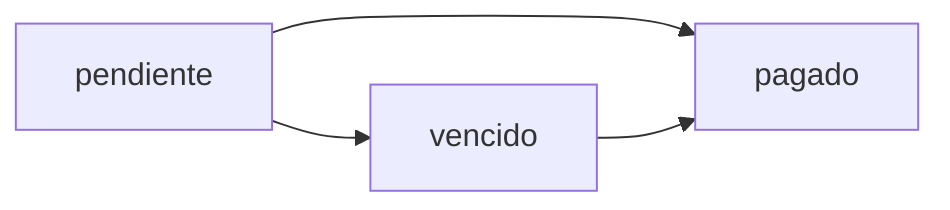

## Overview

ArrendaOco's payment system automates monthly rent generation, tracks payment status, handles late fees, and provides payment history for both landlords and tenants.

## Payment Model

### Database Schema

From migration `2026_01_25_195350_create_pagos_table.php`:

```php
Schema::create('pagos', function (Blueprint $table) {
    $table->id();
    
    $table->foreignId('contrato_id')
        ->constrained('contratos')
        ->cascadeOnDelete();
    
    $table->unsignedTinyInteger('mes');    // 1-12
    $table->unsignedSmallInteger('anio');  // Year
    
    $table->decimal('monto', 10, 2);
    
    $table->enum('estatus', ['pendiente', 'pagado', 'vencido'])
        ->default('pendiente');
    
    $table->timestamp('fecha_pago')->nullable();
    
    $table->timestamps();
    
    // Prevent duplicate payments for same month
    $table->unique(['contrato_id', 'mes', 'anio']);
});
```

### Fields

| Field | Type | Description |
|-------|------|-------------|
| `contrato_id` | foreign key | Associated rental contract |
| `mes` | tinyint | Month (1-12) |
| `anio` | smallint | Year (e.g., 2026) |
| `monto` | decimal | Payment amount |
| `estatus` | enum | `pendiente`, `pagado`, `vencido` |
| `fecha_pago` | timestamp | When payment was made |

<Note>
The unique constraint `(contrato_id, mes, anio)` ensures only one payment exists per contract per month.
</Note>

## Generating Payments

Landlords generate monthly rent payments for active contracts.

### API Endpoint

**Route**: `POST /api/contratos/{contrato}/pagos/generar`

**Authorization**: Only the contract owner (landlord)

**Request Example**:

```json
{
  "meses": 12
}
```

This generates 12 monthly payments starting from the contract's `fecha_inicio`.

### Implementation

From app/Http/Controllers/Api/PagoController.php:18-61:

```php
public function generar(Request $request, Contrato $contrato)
{
    // Validate contract status
    if ($contrato->estatus !== 'activo') {
        abort(422, 'El contrato no está activo');
    }
    
    // Validate input
    $data = $request->validate([
        'meses' => 'required|integer|min:1|max:24',
    ]);
    
    $meses = $data['meses'];
    $fechaInicio = Carbon::parse($contrato->fecha_inicio);
    
    $pagos = [];
    
    DB::transaction(function () use ($contrato, $fechaInicio, $meses, &$pagos) {
        for ($i = 0; $i < $meses; $i++) {
            $fechaPago = $fechaInicio->copy()->addMonths($i);
            
            $pago = Pago::firstOrCreate(
                [
                    'contrato_id' => $contrato->id,
                    'mes' => $fechaPago->month,
                    'anio' => $fechaPago->year,
                ],
                [
                    'monto' => $contrato->renta_mensual,
                    'estatus' => 'pendiente',
                ]
            );
            
            $pagos[] = $pago;
        }
    });
    
    return response()->json([
        'contrato_id' => $contrato->id,
        'pagos_generados' => count($pagos),
        'pagos' => $pagos,
    ], 201);
}
```

**Response Example**:

```json
{
  "contrato_id": 1,
  "pagos_generados": 12,
  "pagos": [
    {
      "id": 45,
      "contrato_id": 1,
      "mes": 3,
      "anio": 2026,
      "monto": 3500.00,
      "estatus": "pendiente",
      "fecha_pago": null
    },
    // ... 11 more months
  ]
}
```

<Tip>
Using `firstOrCreate` prevents duplicate payments. If a payment for that month already exists, it won't be recreated.
</Tip>

## Paying Rent

Tenants mark payments as paid once they complete the transaction.

### API Endpoint

**Route**: `POST /api/pagos/{pago}/pagar`

**Authorization**: Only the tenant (contract's `inquilino_id`)

**Request**: No body required

**Response Example**:

```json
{
  "id": 45,
  "contrato_id": 1,
  "mes": 3,
  "anio": 2026,
  "monto": 3500.00,
  "estatus": "pagado",
  "fecha_pago": "2026-03-05T14:23:00Z"
}
```

### Implementation

From app/Http/Controllers/Api/PagoController.php:66-83:

```php
public function pagar(Pago $pago, Request $request)
{
    // Only tenant can pay
    if ($pago->contrato->inquilino_id !== $request->user()->id) {
        abort(403, 'No autorizado para pagar este recibo');
    }
    
    if ($pago->estatus === 'pagado') {
        abort(422, 'Este pago ya fue liquidado');
    }
    
    $pago->update([
        'estatus' => 'pagado',
        'fecha_pago' => now(),
    ]);
    
    return response()->json($pago);
}
```

<Warning>
This endpoint updates the payment status but does not process actual payment transactions. Integration with payment gateways (PayPal, Stripe, etc.) must be implemented separately.
</Warning>

## Viewing Pending Payments

Get all pending and overdue payments for the authenticated user.

### API Endpoint

**Route**: `GET /api/pagos/pendientes`

**Authorization**: Required (tenant or landlord)

**Response Example**:

```json
[
  {
    "id": 45,
    "contrato_id": 1,
    "inmueble_titulo": "Casa cerca de la UTS",
    "monto": 3500.00,
    "mes": 3,
    "anio": 2026,
    "estatus": "pendiente",
    "fecha_pago": "2026-03-01"
  },
  {
    "id": 38,
    "contrato_id": 2,
    "inmueble_titulo": "Departamento en el Centro",
    "monto": 4200.00,
    "mes": 2,
    "anio": 2026,
    "estatus": "vencido",
    "fecha_pago": "2026-02-01"
  }
]
```

### Implementation

From app/Http/Controllers/Api/PagoController.php:110-137:

```php
public function pendientes(Request $request)
{
    $usuario = $request->user();
    
    $pagos = Pago::with(['contrato.inmueble'])
        ->whereHas('contrato', function ($query) use ($usuario) {
            $query->where('propietario_id', $usuario->id)
                  ->orWhere('inquilino_id', $usuario->id);
        })
        ->whereIn('estatus', ['pendiente', 'vencido'])
        ->orderBy('anio')
        ->orderBy('mes')
        ->get();
    
    return response()->json($pagos->map(function($p) {
        return [
            'id' => $p->id,
            'contrato_id' => $p->contrato_id,
            'inmueble_titulo' => $p->contrato->inmueble->titulo,
            'monto' => $p->monto,
            'mes' => $p->mes,
            'anio' => $p->anio,
            'estatus' => $p->estatus,
            'fecha_pago' => Carbon::create($p->anio, $p->mes, 1)->toDateString(),
        ];
    }));
}
```

## Payment Status Flow



- **pendiente**: Payment due, not yet paid
- **pagado**: Payment completed
- **vencido**: Payment overdue (managed by scheduled task)

<Accordion title="Automatic Late Status">
ArrendaOco should implement a scheduled job (Laravel scheduler) that runs daily to update payments with `estatus = 'pendiente'` to `'vencido'` when the current date passes the payment due date.
</Accordion>

## Late Fees (Recargos)

The system supports late fee charges via migration `2026_01_25_213548_add_recargos_to_pagos_table.php`.

### Extended Schema

```php
$table->decimal('recargo', 10, 2)->default(0);
$table->text('nota_recargo')->nullable();
```

| Field | Type | Description |
|-------|------|-------------|
| `recargo` | decimal | Late fee amount |
| `nota_recargo` | text | Reason for late fee |

**Example Usage**:

```php
$pago->update([
    'recargo' => 175.00,  // 5% of 3500
    'nota_recargo' => 'Pago recibido 7 días después de la fecha límite'
]);
```

## Account Statement Integration

Payments are displayed in contract account statements.

**Route**: `GET /api/contratos/{contrato}/estado-cuenta`

See [Contracts > Account Statement](/features/contracts#account-statement-estado-de-cuenta) for full details.

**Example Summary**:

```json
{
  "resumen": {
    "total_pagado": 21000.00,
    "total_pendiente": 7000.00,
    "vencidos": 1
  }
}
```

## Payment Reports

Landlords can generate income reports.

**Route**: `GET /api/reportes/ingresos`

Filters by date range and contract to calculate total income, pending payments, and average collection time.

## Best Practices

### For Landlords

1. **Generate payments in bulk**: Create 6-12 months of payments when contract starts
2. **Monitor pending payments**: Check `/api/pagos/pendientes` regularly
3. **Generate monthly statements**: Use PDF statements for formal records

### For Tenants

1. **Check pending payments**: View `/api/pagos/pendientes` before due date
2. **Pay on time**: Mark payments as `pagado` promptly to avoid late fees
3. **Keep receipts**: Download PDF account statements as proof of payment

## Payment Methods Integration

<Accordion title="Implementing Payment Gateways">
ArrendaOco's payment system is designed to be extended with actual payment processing. Recommended integrations:

**PayPal**
```php
use PayPal\Rest\ApiContext;

public function pagarConPayPal(Pago $pago, Request $request)
{
    $payment = new Payment();
    $payment->setIntent('sale')
        ->setAmount([
            'total' => $pago->monto,
            'currency' => 'MXN'
        ]);
    
    $payment->create($apiContext);
    
    if ($payment->getState() === 'approved') {
        $pago->update(['estatus' => 'pagado', 'fecha_pago' => now()]);
    }
}
```

**Stripe**
```php
use Stripe\Stripe;
use Stripe\PaymentIntent;

Stripe::setApiKey(env('STRIPE_SECRET'));

$intent = PaymentIntent::create([
    'amount' => $pago->monto * 100, // Convert to cents
    'currency' => 'mxn',
    'metadata' => ['pago_id' => $pago->id],
]);
```
</Accordion>

## Web Routes for Payments

While most payment operations use the API, there are test routes for UI development:

**Routes** (routes/web.php:271-281):

```php
Route::prefix('test-pagos')->group(function () {
    Route::get('/', function () {
        return view('pagos.index');
    })->name('pagos.test.index');
    
    Route::get('/checkout', function () {
        return view('pagos.checkout');
    })->name('pagos.test.checkout');
    
    Route::get('/success', function () {
        return view('pagos.success');
    })->name('pagos.test.success');
});
```

## API Endpoints Summary

| Method | Endpoint | Auth | Description |
|--------|----------|------|-------------|
| POST | `/api/contratos/{id}/pagos/generar` | Yes | Generate monthly payments |
| POST | `/api/pagos/{id}/pagar` | Yes (tenant) | Mark payment as paid |
| GET | `/api/pagos/pendientes` | Yes | List pending/overdue payments |
| GET | `/api/contratos/{id}/estado-cuenta` | Yes | View payment history |

## Next Steps

- [View Contract Details](/features/contracts)
- [Download Account Statements](/features/contracts#pdf-generation)
- [Track Payment History](/api/payments/pending)
