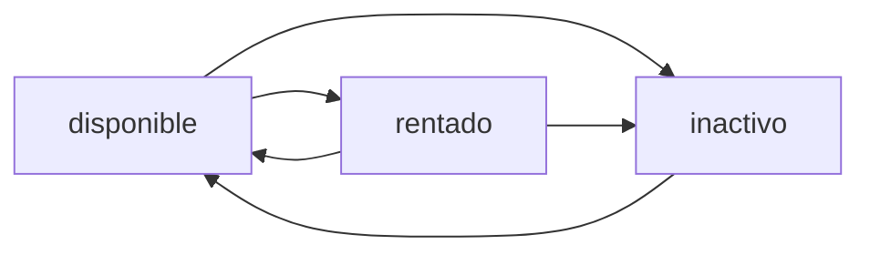

## Overview

ArrendaOco provides comprehensive property (inmuebles) management for landlords to publish listings, and for tenants to search and discover available rentals in Ocosingo, Chiapas.

## Property Model

### Database Schema

From migration `2026_01_25_185535_create_inmuebles_table.php`:

```php
Schema::create('inmuebles', function (Blueprint $table) {
    $table->id();
    
    $table->foreignId('propietario_id')
          ->constrained('usuarios')
          ->cascadeOnDelete();
    
    $table->string('titulo');
    $table->text('descripcion')->nullable();
    $table->string('direccion');
    $table->string('ciudad');
    $table->string('estado');
    $table->string('codigo_postal', 10);
    
    $table->decimal('renta_mensual', 10, 2);
    $table->decimal('deposito', 10, 2)->nullable();
    
    $table->enum('estatus', ['disponible', 'rentado', 'inactivo'])
          ->default('disponible');
    
    $table->timestamps();
});
```

### Additional Fields

The schema was extended to include:

- **tipo**: Property type (casa, departamento, cuarto, local, terreno)
- **habitaciones**: Number of bedrooms
- **banos**: Number of bathrooms
- **metros**: Square meters
- **latitud**, **longitud**: GPS coordinates for maps
- **imagen**: Main cover image
- **video_youtube**: YouTube video URL
- **video metadata**: Title, thumbnail, channel, views, duration

## Creating Properties

### Web Interface

**Route**: `POST /publicar`

**Access**: Requires `propietario` role

**Form Validation** (app/Http/Controllers/InmuebleController.php:325-343):

```php
$rules = [
    'nombre'        => 'required|string|max:255',
    'tipo'          => 'required|string',
    'precio'        => 'required|numeric',
    'habitaciones'  => 'required|integer',
    'banos'         => 'required|integer',
    'metros'        => 'required|numeric',
    'descripcion'   => 'required|string',
    'direccion'     => 'required|string',
    'imagenes'      => 'required|array|min:1|max:10',
    'imagenes.*'    => 'image|max:10240',
    'latitud'       => 'nullable|numeric',
    'longitud'      => 'nullable|numeric',
    'video_youtube' => 'nullable|url|max:255',
];
```

### Implementation Example

From app/Http/Controllers/InmuebleController.php:325-397:

```php
public function store(Request $request)
{
    $request->validate($rules);
    
    try {
        DB::beginTransaction();
        
        $inmueble = new Inmueble();
        $inmueble->titulo = $request->nombre;
        $inmueble->descripcion = $request->descripcion;
        $inmueble->direccion = $request->direccion;
        $inmueble->tipo = $request->tipo;
        $inmueble->renta_mensual = $request->precio;
        $inmueble->deposito = $request->precio;
        $inmueble->habitaciones = $request->habitaciones;
        $inmueble->banos = $request->banos;
        $inmueble->metros = $request->metros;
        $inmueble->latitud = $request->latitud;
        $inmueble->longitud = $request->longitud;
        $inmueble->propietario_id = auth()->id();
        
        // Store cover image
        $primeraImagen = $request->file('imagenes')[0];
        $pathPortada = $primeraImagen->store('inmuebles', 'public');
        $inmueble->imagen = '/storage/' . $pathPortada;
        
        $inmueble->save();
        
        // Store additional images
        foreach ($request->file('imagenes') as $foto) {
            $path = $foto->store('inmuebles', 'public');
            DB::table('imagenes_inmuebles')->insert([
                'inmueble_id' => $inmueble->id,
                'ruta_imagen' => '/storage/' . $path,
                'created_at' => now(),
                'updated_at' => now(),
            ]);
        }
        
        DB::commit();
        return redirect()->route('inmuebles.index')
            ->with('success', '¡Propiedad publicada correctamente!');
    } catch (\Exception $e) {
        DB::rollBack();
        return back()->with('error', 'Error: ' . $e->getMessage());
    }
}
```

<Note>
Properties are created with `estatus = 'disponible'` by default. When a contract is created, the status changes to `'rentado'`.
</Note>

## YouTube Video Integration

ArrendaOco automatically fetches YouTube video metadata when a property includes a video URL.

### Supported URL Formats

- `https://youtu.be/VIDEO_ID`
- `https://youtube.com/watch?v=VIDEO_ID`
- `https://youtube.com/embed/VIDEO_ID`
- `https://youtube.com/shorts/VIDEO_ID`

### Video ID Extraction

From app/Http/Controllers/InmuebleController.php:19-38:

```php
private function extractYouTubeId(?string $url): ?string
{
    if (!$url) return null;
    
    $patterns = [
        '/youtu\.be\/([a-zA-Z0-9_-]{11})/',
        '/youtube\.com\/watch\?(?:.*&)?v=([a-zA-Z0-9_-]{11})/',
        '/youtube\.com\/embed\/([a-zA-Z0-9_-]{11})/',
        '/youtube\.com\/shorts\/([a-zA-Z0-9_-]{11})/',
        '/youtube\.com\/v\/([a-zA-Z0-9_-]{11})/',
    ];
    
    foreach ($patterns as $pattern) {
        if (preg_match($pattern, $url, $matches)) {
            return $matches[1];
        }
    }
    
    return null;
}
```

### Fetching Metadata

ArrendaOco uses the **YouTube Data API v3** with fallback to oEmbed:

```php
private function getYouTubeMeta(string $videoId): ?array
{
    $apiKey = config('services.youtube.api_key');
    
    if ($apiKey) {
        $response = Http::timeout(8)->get(
            'https://www.googleapis.com/youtube/v3/videos',
            [
                'id'   => $videoId,
                'key'  => $apiKey,
                'part' => 'snippet,contentDetails,statistics',
            ]
        );
        
        if ($response->successful()) {
            $item = $response->json('items')[0];
            return [
                'titulo'       => $item['snippet']['title'],
                'canal'        => $item['snippet']['channelTitle'],
                'descripcion'  => $item['snippet']['description'],
                'duracion'     => $this->formatDuration($item['contentDetails']['duration']),
                'vistas'       => $item['statistics']['viewCount'],
                'likes'        => $item['statistics']['likeCount'],
                'thumbnail'    => $item['snippet']['thumbnails']['maxres']['url'],
            ];
        }
    }
    
    // Fallback to oEmbed (free, no API key)
    return $this->getOEmbedData($videoId);
}
```

<Tip>
You can refresh video metadata for existing properties using the endpoint: `POST /inmuebles/{inmueble}/refresh-video`
</Tip>

## Searching Properties

### Public Search

**Web Route**: `GET /buscar`

**API Route**: `GET /api/inmuebles/public-list`

**Query Parameters**:

- `ubicacion`: Search in title, address, or city
- `categoria`: Filter by property type (casa, departamento, cuarto)
- `rango_precio`: Price ranges (0-2000, 2000-4000, 4000-6000, 6000+)

**Implementation** (app/Http/Controllers/InmuebleController.php:257-301):

```php
public function publicSearch(Request $request)
{
    $query = Inmueble::where('estatus', 'disponible');
    
    // Filter by location
    if ($request->filled('ubicacion')) {
        $query->where(function($q) use ($request) {
            $q->where('titulo', 'like', '%' . $request->ubicacion . '%')
              ->orWhere('direccion', 'like', '%' . $request->ubicacion . '%')
              ->orWhere('ciudad', 'like', '%' . $request->ubicacion . '%');
        });
    }
    
    // Filter by type
    if ($request->filled('categoria')) {
        $query->where('tipo', $request->categoria);
    }
    
    // Filter by price range
    if ($request->filled('rango_precio')) {
        switch ($request->rango_precio) {
            case '0-2000':
                $query->whereBetween('renta_mensual', [0, 2000]);
                break;
            case '2000-4000':
                $query->whereBetween('renta_mensual', [2000, 4000]);
                break;
            case '4000-6000':
                $query->whereBetween('renta_mensual', [4000, 6000]);
                break;
            case '6000+':
                $query->where('renta_mensual', '>=', 6000);
                break;
        }
    }
    
    $inmuebles = $query->paginate(12);
    
    return view('inmuebles.public_index', compact('inmuebles'));
}
```

### Search Example

```bash
GET /buscar?ubicacion=UTS&categoria=cuarto&rango_precio=0-2000
```

Returns available rooms near the university (UTS) under $2,000 MXN/month.

## Viewing Property Details

**Web Route**: `GET /inmuebles/{inmueble}`

**API Route**: `GET /api/inmuebles/public-detail/{inmueble}`

**Implementation** (app/Http/Controllers/InmuebleController.php:308-313):

```php
public function show(Inmueble $inmueble)
{
    $inmueble->load(['propietario', 'resenas.usuario']);
    $imagenes = DB::table('imagenes_inmuebles')
        ->where('inmueble_id', $inmueble->id)
        ->get();
    
    return view('inmuebles.show', compact('inmueble', 'imagenes'));
}
```

## Managing Properties (Landlord)

### List My Properties

**Route**: `GET /mis-propiedades`

**Access**: Requires authentication

```php
public function index(Request $request)
{
    $query = Inmueble::where('propietario_id', auth()->id());
    
    if ($search = $request->search) {
        $query->where(function($q) use ($search) {
            $q->where('titulo', 'like', "%$search%")
              ->orWhere('direccion', 'like', "%$search%")
              ->orWhere('tipo', 'like', "%$search%");
        });
    }
    
    $inmuebles = $query->paginate(10);
    return view('inmuebles.index', compact('inmuebles'));
}
```

### Update Property

**Route**: `PUT /inmuebles/{inmueble}`

**Authorization**: Only the owner or admin can update

```php
public function update(Request $request, Inmueble $inmueble)
{
    if ($inmueble->propietario_id !== auth()->id() && 
        !auth()->user()->es_admin) {
        abort(403);
    }
    
    $request->validate([
        'nombre' => 'required|string|max:255',
        'tipo' => 'required|string',
        'precio' => 'required|numeric',
        'descripcion' => 'required|string',
        'direccion' => 'required|string',
    ]);
    
    $inmueble->update([
        'titulo' => $request->nombre,
        'tipo' => $request->tipo,
        'renta_mensual' => $request->precio,
        'descripcion' => $request->descripcion,
        'direccion' => $request->direccion,
    ]);
    
    return redirect()->route('inmuebles.index')
        ->with('success', 'Propiedad actualizada con éxito.');
}
```

### Delete Property

**Route**: `DELETE /inmuebles/{inmueble}`

<Warning>
Deleting a property will cascade delete all related records: images, contracts, payments, reviews, and favorites.
</Warning>

```php
public function destroy(Inmueble $inmueble)
{
    if ($inmueble->propietario_id !== auth()->id() && 
        !auth()->user()->es_admin) {
        abort(403);
    }
    
    $inmueble->delete();
    return redirect()->route('inmuebles.index')
        ->with('success', 'Propiedad eliminada correctamente.');
}
```

## Image Management

Properties support multiple images stored in the `imagenes_inmuebles` table.

### Upload Constraints

- **Minimum**: 1 image required
- **Maximum**: 10 images per property
- **File size**: Max 10MB per image
- **Format**: JPEG, PNG, GIF

### Storage

Images are stored in `storage/app/public/inmuebles/` and served via `/storage/inmuebles/`.

## Map Integration

Properties with GPS coordinates (`latitud`, `longitud`) are displayed on an interactive map.

**Example Usage** (routes/web.php:244-255):

```php
public function home()
{
    $inmuebles = Inmueble::where('estatus', 'disponible')
        ->latest()
        ->paginate(9);
    
    $inmueblesMapa = Inmueble::where('estatus', 'disponible')->get();
    
    return view('inicio', compact('inmuebles', 'inmueblesMapa'));
}
```

<Accordion title="Coordinates Format">
- **Latitud**: Decimal degrees (e.g., 16.9094)
- **Longitud**: Decimal degrees (e.g., -92.0933)
- Coordinates for Ocosingo, Chiapas, Mexico
</Accordion>

## Property Status Flow



- **disponible**: Listed and available for rent
- **rentado**: Currently rented (has active contract)
- **inactivo**: Temporarily unlisted by owner

## API Endpoints Summary

| Method | Endpoint | Auth | Description |
|--------|----------|------|-------------|
| GET | `/api/inmuebles/public-list` | No | List available properties |
| GET | `/api/inmuebles/public-detail/{id}` | No | Get property details |
| GET | `/api/inmuebles` | Yes | List my properties (landlord) |
| POST | `/api/inmuebles` | Yes | Create new property |
| PUT | `/api/inmuebles/{id}` | Yes | Update property |
| DELETE | `/api/inmuebles/{id}` | Yes | Delete property |

## Next Steps

- [Leave a Review](/features/reviews)
- [Add to Favorites](/features/favorites)
- [Create a Rental Contract](/features/contracts)
- [Ask Arrendito AI](/features/arrendito-ai)
